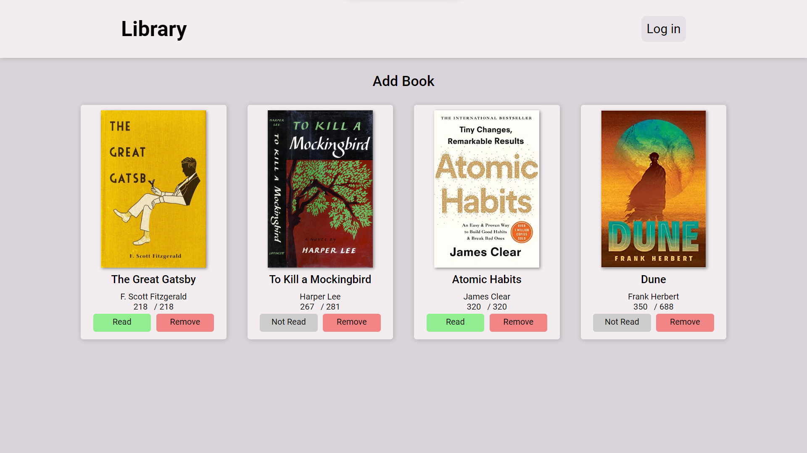

# Book Library Manager

This Vanilla JS website allows users to manage a library of books.

## Features

* Add books with name, author, total pages, read pages, read status, and cover
* Set books as read or unread
* Change the number of pages read for a book
* Delete books from the library
* Responsive design

This website uses object-oriented programming (OOP) to manage the library of books. This makes the code more modular and reusable, and it also makes it easier to add new features in the future.

## Live Demo

[Book Library Manager Live Demo](https://mohamed-amr7.github.io/Book-Library-Manager/)

This link will take you to a live demo of the Book Library Manager website. You can use this demo to try out the features of the website.

## Contributing

Contributions are welcome to this project. If you would like to contribute, please follow these steps:

1. Fork the repository.
2. Create a new branch for your changes.
3. Make your changes and commit them to your branch.
4. Push your branch to GitHub.
5. Open a pull request against the main branch.

Thank you for your interest in contributing to this project!